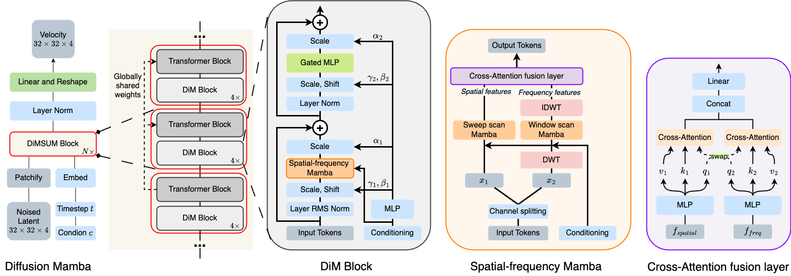

##### Table of contents
1. [Overview](#overview)
1. [Installation](#installation)
2. [Data](#data)
3. [Pretrained weights](#pretrained-weights)
4. [Train](#train)
5. [Evaluation](#evaluation)
6. [Implementation details](#implementation-details)
7. [Acknowledgments](#acknowledgments)
8. [Contacts](#contacts)

<div align="center">
<h1>Official PyTorch implementation of "DiMSUM: Diffusion Mamba - A Scalable and Unified
Spatial-Frequency Method for Image Generation" <a href="https://arxiv.org/abs/2411.04168"> (NeurIPS'24)</a></h1>
</div>

<div align="center">
  <a href="https://hao-pt.github.io/" target="_blank">Hao&nbsp;Phung</a><sup>*13&dagger;</sup> &emsp; <b>&middot;</b> &emsp;
  <a href="https://quandao10.github.io/" target="_blank">Quan&nbsp;Dao</a><sup>*12&dagger;</sup> &emsp; <b>&middot;</b> &emsp;
  <a href="https://termanteus.com/" target="_blank">Trung&nbsp;Dao</a><sup>1</sup>
  <br> <br>
  <a href="https://viethoang1512.github.io/" target="_blank">Hoang&nbsp;Phan</a><sup>4</sup> &emsp; <b>&middot;</b> &emsp;
  <a href="https://people.cs.rutgers.edu/~dnm/" target="_blank"> Dimitris&nbsp;N. Metaxas</a><sup>2</sup> &emsp; <b>&middot;</b> &emsp;
  <a href="https://sites.google.com/site/anhttranusc/" target="_blank">Anh&nbsp;Tran</a><sup>1</sup>
  <br> <br>
  <sup>1</sup>VinAI Research &emsp;
  <sup>2</sup>Rutgers University &emsp;
  <sup>3</sup>Cornell University &emsp;
  <sup>4</sup>New York University
  <br> <br>
  <a href="https://vinairesearch.github.io/DiMSUM/">[Page]</a> &emsp;&emsp;
  <a href="https://arxiv.org/abs/2411.04168">[Paper]</a> &emsp;&emsp;
  <a href="https://huggingface.co/haopt/dimsum-L2-imagenet256">[HuggingFace ]</a> &emsp;&emsp;
  
  <br> <br>
  <emp><sup>*</sup>Equal contribution</emp> &emsp;
  <emp><sup>&dagger;</sup>Work done while at VinAI Research</emp>
</div>


## Overview
<div align="center">

</div>

We propose DiMSUM, a hybrid Mamba-Transformer diffusion model that synergistically leverages both spatial and frequency information for high-quality image synthesis. Through extensive experiments on standard benchmarks, our method achieves state-of-the-art results, with a FID of 4.62 on CelebHQ 256, 3.76 on LSUN Church, and 2.11 on ImageNet1k 256. Additionally, our approach attains faster training convergence compared to Zigma and other diffusion methods. In detail, our method outperforms both DiT and SiT while requiring less than a third of the training iterations, achieving the best FID score of 2.11.

Details of the model architecture and experimental results can be found in our following paper:

```bibtex
@inproceedings{phung2024dimsum,
   title={DiMSUM: Diffusion Mamba - A Scalable and Unified Spatial-Frequency Method for Image Generation},
   author={Phung, Hao and Dao, Quan and Dao, Trung and Phan, Hoang and Metaxas, Dimitris and Tran, Anh},
   booktitle={The Thirty-eighth Annual Conference on Neural Information Processing Systems},
   year= {2024},
}
```

**Please CITE** our paper and give us a :star: whenever this repository is used to help produce published results or incorporated into other software.

**News**

- [Feb 17th, 2025] Upload ImageNet-1K model onto [HuggingFace ](https://huggingface.co/haopt/dimsum-L2-imagenet256) for easy access.

## Installation

- Python 3.10.13

  - `conda create -n dimsum python=3.10.13`

- torch 2.1.1 + cu118
  - `pip install torch==2.1.1 torchvision==0.16.1 torchaudio==2.1.1 --index-url https://download.pytorch.org/whl/cu118`

- Requirements:
  - `pip install -r requirements.txt`

- Install ``causal_conv1d`` and ``mamba``
  - `conda install conda-forge::cudatoolkit-dev`
  - `cd causal_conv1d && pip install -e . && cd ..`
  - `cd mamba && pip install -e . && cd ..`

- Add python path for DiMSUM: `export PYTHONPATH=$PYTHONPATH:$(pwd)`


## Data
### Training
For CelebA HQ (256) and LSUN, please follow [this repo](https://github.com/NVlabs/NVAE.git) for dataset preparation.

### Evaluation
For evaluation, please resize and extract "jpeg" images from dataset first.

For LMDB data (like `celeba_256` and `lsun_church`), run this command:
```bash
python eval_toolbox/resize_lmdb.py --dataset celeba_256 --datadir ./data/celeba_256/celeba-lmdb/ --image_size 256 --save_dir real_samples/
```

For image folder of jpeg/png images, run this command instead: 
```bash
python eval_toolbox/resize.py main input_data_dir real_samples/dataname
```

## Pretrained Weights
Currently, there is a Hugging Face model for ImageNet-1K available at [`haopt/dimsum-L2-imagenet256`](https://huggingface.co/haopt/dimsum-L2-imagenet256). To use, simply set `--ckpt haopt/dimsum-L2-imagenet256` in sampling bash scripts of [Evaluation](#evaluation). 

Or manually download all models with provided links below:

<table>
  <tr>
    <th>Exp</th>
    <th>#Params</th>
    <th>FID</th>
    <th>Checkpoints</th>
  </tr>

  <tr>
    <td> Celeba 256 </td>
    <td> 460M </td>
    <td> 4.62 </td>
    <td><a href="https://drive.google.com/file/d/1FTSBJ7YMQWYa0ydFfdgKfUsPdqKXous9/view?usp=drive_link">celeb256_225ep.pt</a></td>
  </tr>

  <tr>
    <td> Church 256 </td>
    <td> 460M </td>
    <td> 3.76 </td>
    <td><a href="https://drive.google.com/file/d/1I1ghI8H_DPurnaLXDEBzEiDRptveSab1/view?usp=drive_link">church_395ep.pt</a></td>
  </tr>

  <tr>
    <td> ImageNet-1K 256 (CFG) </td>
    <td> 460M </td>
    <td> 2.11 </td>
    <td><a href="https://drive.google.com/file/d/18ZBM3zFD8Va55UZe8S2yUXmXhVzWfFV3/view?usp=drive_link">imnet256_510ep.pt</a></td>
  </tr>

  <!-- <tr>
    <td> Celeba 512 </td>
    <td> 461M </td>
    <td> 6.09 </td>
    <td><a href="">celeb512_165ep.pth</a></td>
  </tr> -->

</table>

## Train
Comment/Uncomment command lines for desired dataset, then run:
`bash scripts/train.sh`

## Evaluation
To sampe images from pretrained checkpoints, run:
```bash
bash scripts/sample.sh
```

To evaluate, select a relevant command and run:
```bash
bash scripts/eval.sh
```

## Implementation details
- DiMSUM architecture is put in [dimsum/models_dim.py](dimsum/models_dim.py).
- Conditional Mamba can be found in [mamba/mamba_ssm/ops/selective_scan_interface.py](mamba/mamba_ssm/ops/selective_scan_interface.py) and [causal-conv1d/csrc/causal_conv1d.cpp](causal-conv1d/csrc/causal_conv1d.cpp).
- Frequency transformations: [dimsum/wavelet_layer.py](dimsum/wavelet_layer.py) and [dimsum/dct_layer.py](dimsum/dct_layer.py).
- Mamba Scanning strategies (e.g. sweep8, jpeg8): [dimsum/scanning_orders.py](dimsum/scanning_orders.py).

## Acknowledgments

This project is based on [Vim](https://github.com/hustvl/Vim.git), [LFM](https://github.com/VinAIResearch/LFM.git), [SiT](https://github.com/willisma/SiT.git), [DiT](https://github.com/facebookresearch/DiT.git), [ZigMa](https://github.com/CompVis/zigma.git). Thanks for publishing their wonderful works with codes.

## Contacts
If you have any problems, please open an issue in this repository or ping an email to tienhaophung@gmail.com and kevinquandao10@gmail.com.
